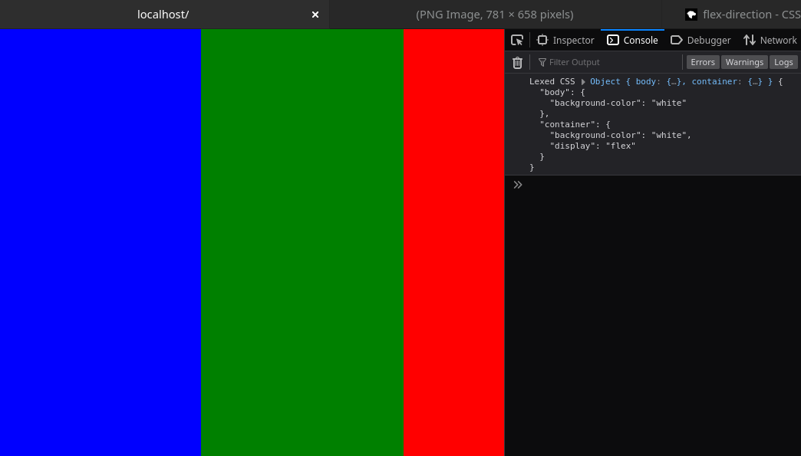

# @repcomm/csspr

CSS Pseudo Renderer

I want to create my own CLI and graphical browser engines eventually, so this is a necessity.

This software lib has no dependencies and is intended to work with nodejs and web.

A demo can be found at index.html and index.ts

The code is imported from mod.js, which can be required from node_modules even within browser (see index.ts for example)



## State
- Lex CSS into JS objects
## Target State
- Render bounding boxes

## Intended use
- Import CSS string, file, or URL
- Supply basic DOM tree
- Call render to generate BBOXes
- Use BBOXes however you want

## Future hurdles anticipated
- This software knows nothing about font<br/>
Could be solved by using an average font metric hard coded, as well as the ability to supply font info for calculations from host software. This isn't a huge issue.

## Current API
```ts
CSSPR.load (url): Promise<CSSPRStyleSheet>
```
Loads a CSS file from a URL and returns the JS object representation
Also adds to CSSPR.stylesheet.all array
